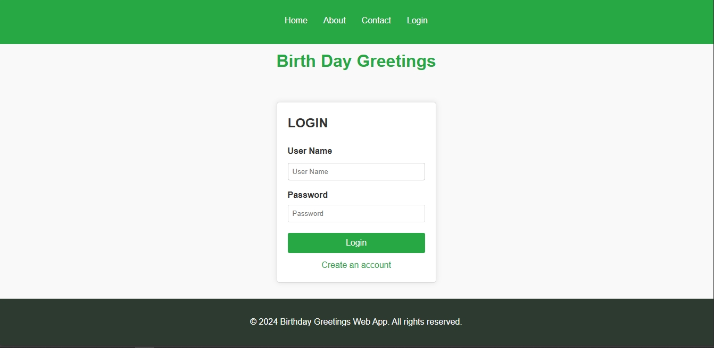
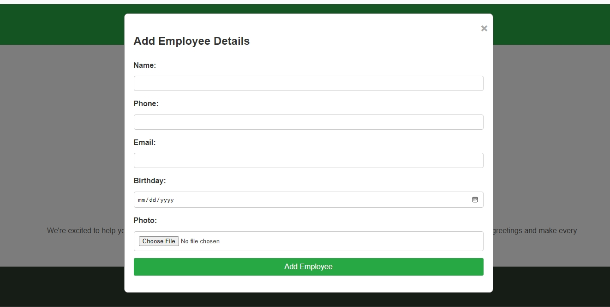

###  Birthday Greeting Web Program

```markdown
# Birthday Greeting Web Program

## Overview

The Birthday Greeting Web Program is a web-based system designed for organizations to automate sending birthday greetings to their employees. The system enables administrators to manage employee information, customize greeting templates, and send personalized birthday messages via email automatically. This project was developed using PHP, MySQL, HTML, CSS, and JavaScript.

## Features

- **User Authentication:** Secure login for administrators.
- **Employee Management:** Add, update, and delete employee information, including personal details and birthday.
- **Automated Birthday Greetings:** Automatically send personalized birthday greetings via email using cron jobs.
- **Responsive Design:** The website is optimized for both desktop and mobile use.
  
## Installation

### Prerequisites

- PHP (version 7.4 or higher)
- MySQL (version 5.7 or higher)
- Apache or any other web server supporting PHP
- Composer (for dependency management)

### Steps to Install

1. **Clone the Repository:**
   ```bash
   git clone https://github.com/your-username/birthday-greeting-web.git
   cd birthday-greeting-web
   ```

2. **Configure the Database:**
   - Create a MySQL database.
   - Import the provided `birthday_greetings.sql` file into the database to create the necessary tables:
     ```bash
     mysql -u [your_username] -p [your_database_name] < birthday_greetings.sql
     ```

3. **Set Up Environment Variables:**
   - Rename the `config.example.php` file to `config.php`.
   - Edit `config.php` with your database credentials:
     ```php
     <?php
     define('DB_HOST', 'localhost');
     define('DB_USER', 'your_db_user');
     define('DB_PASS', 'your_db_password');
     define('DB_NAME', 'your_db_name');
     ?>
     ```

4. **Install Dependencies (if applicable):**
   If the project requires Composer dependencies, run:
   ```bash
   composer install
   ```

5. **Set Up Cron Job:**
   To enable the automated greeting system, set up a cron job to run daily:
   ```bash
   0 0 * * * /usr/bin/php /path_to_your_project/send_greetings.php
   ```

6. **Run the Project:**
   - Deploy the project on your local server (e.g., using XAMPP, MAMP, or a live server).
   - Navigate to `http://localhost/birthday-greeting-web/` in your browser.

## Usage

### Admin Login
- Admins can log in using their credentials on the login page to access the employee management dashboard.

### Employee Management
- Add, update, and delete employee information, including details like name, birthday, email, and phone number.
  
### Automated Greetings
- The system automatically sends personalized birthday greetings via email on the employee's birthday based on the configured cron job.


## Screenshots

### Login Page


### Employee Management Page



## Future Enhancements

- **Multi-Channel Greeting Delivery:** Add support for sending birthday greetings via SMS or other messaging platforms (e.g., WhatsApp).
- **Employee Self-Service:** Allow employees to update their own profiles and select how they want to receive greetings.
- **Advanced Analytics:** Add a dashboard for administrators to view statistics on greeting deliveries and employee engagement.
  
## Contributing

Contributions are welcome! If you find any issues or have ideas for new features, feel free to open a pull request or issue.

### Steps to Contribute:
1. Fork this repository.
2. Create a new branch for your feature or bugfix (`git checkout -b feature/new-feature`).
3. Commit your changes (`git commit -m 'Add new feature'`).
4. Push to the branch (`git push origin feature/new-feature`).
5. Open a pull request.

## License

This project is licensed under the MIT License. See the `LICENSE` file for more details.

## Contact

If you have any questions or feedback, feel free to contact us at [your-email@example.com].

---

Thank you for using the Birthday Greeting Web Program!
```

Replace the placeholder links, images, and contact details with your actual information when setting up the repository on GitHub.
